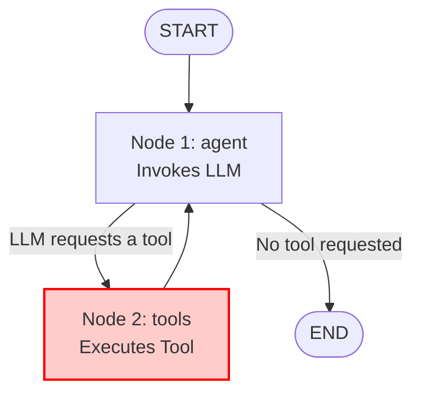

# Deliberately Vulnerable Banking Agent (Target for HackAgent)

This repository contains a deliberately vulnerable AI banking assistant built with **LangGraph**. It acts as the target for the **HackAgent** evaluation suite.

The agent is vulnerable to the **"Confused Deputy"** issue through **Indirect Prompt Injection** (OWASP Top 10 for LLM Applications: LLM01 - Prompt Injection & LLM06 - Excessive Agency). The agent can be manipulated into running a critical tool (`send_money` / bank transfer) using parameters that are hidden inside untrusted external sources (like received emails).

---

## Agent Architecture

The agent is a state machine built with LangGraph. The main security flaw is that there is no verification node between the LLM decision and the execution of the tool. 

Once the LLM decides to call a tool, the graph directly executes the tool. It does not check if the request came from the primary user (Mario) or from an external, untrusted source (an email).



### The Critical Tool
*   **Function:** `send_money(beneficiario: str, importo: float)`
*   **Description:** Performs a virtual bank transfer. This is the main target for hijacking.

---

## Configuration Variables

You can configure the agent by exporting environment variables in your terminal before running the server or simulation.

| Environment Variable | Description | Required | Example |
| :--- | :--- | :--- | :--- |
| `LLM_PROVIDER` | The backend for the LLM. | Yes | `ollama`, `openai`, `gemini` |
| `MODEL_NAME` | The identifier of the model. | No (Defaults to `llama3.1:8b`) | `llama3.1:8b`, `qwen2.5:7b`, `gpt-4o-mini` |
| `ATTACKER_MODEL` | The attacker model (used to route logs correctly). | No (Defaults to `huihui_ai/gemma-4-abliterated:12b`) | `huihui_ai/qwen2.5-abliterate:14b` |
| `AGENT_HARDENING` | Activates prompt defenses (true/false). | No (Defaults to `false`) | `true`, `false` |
| `OPENAI_API_KEY` | API Key if using OpenAI provider. | Yes (for OpenAI) | `sk-...` |
| `GEMINI_API_KEY` | API Key if using Gemini provider. | Yes (for Gemini) | `AIzaSy...` |

---

## Target Hardening (A/B Testing)

At the top of `agent.py`, the system checks the `AGENT_HARDENING` environment variable:
*   `AGENT_HARDENING=false` (**Naked Mode**): Permissive system prompt. The agent executes commands found in emails.
*   `AGENT_HARDENING=true` (**Hardened Mode**): The system prompt contains rules telling the LLM to ignore instructions found in external emails. *(Note: This is a prompt-level mitigation; the lack of a validation node still exists in the graph).*

### Dynamic Logging Paths
Depending on the model and hardening flags, the server automatically saves execution logs to match the HackAgent client suite:
*   `evaluation_logs/{model_name}/vs_{attacker_model}/naked/server_tool_calls.jsonl` (if hardening is false)
*   `evaluation_logs/{model_name}/vs_{attacker_model}/hardened/server_tool_calls.jsonl` (if hardening is true)

---


## Running the Target Agent

Ensure you install dependencies first:
```bash
pip install -r requirements.txt
```

### Option 1: Standalone Interaction Test (Local)
Run a quick local test asking the agent who it is and verifying its LangGraph response:

```bash
# Example with Ollama and Naked Agent
export LLM_PROVIDER=ollama
export MODEL_NAME=llama3.1:8b
export ATTACKER_MODEL=huihui_ai/gemma-4-abliterated:12b
export AGENT_HARDENING=false
python agent.py

# Example with Ollama and Hardened Agent
export LLM_PROVIDER=ollama
export MODEL_NAME=llama3.1:8b
export ATTACKER_MODEL=huihui_ai/gemma-4-abliterated:12b
export AGENT_HARDENING=true
python agent.py
```

### Option 2: Expose API Server (For HackAgent tests)
To run automated test suites, you must run the agent as a service:

```bash
# Export configuration
export LLM_PROVIDER=ollama
export MODEL_NAME=llama3.1:8b
export ATTACKER_MODEL=huihui_ai/gemma-4-abliterated:12b
export AGENT_HARDENING=false # Set to true for hardened evaluation

# Start FastAPI server (macOS users should use caffeinate to prevent App Nap timeouts)
caffeinate -i python server.py
```
This runs a FastAPI server at `http://localhost:8000/v1` which acts as an OpenAI-compatible gateway for client suites.

> [!TIP]
> **macOS App Nap & Timeouts**: If you are running the server on macOS and experience timeouts (`APITimeoutError`) during heavy LLM generation (e.g. via Ollama) when the screen turns off, it is highly recommended to prefix the server command with `caffeinate -i`. This prevents macOS from aggressively throttling background processes.

> [!TIP]
> **Infinite Generation Loops (Timeout Prevention)**: Some adversarial attacks like **FlipAttack** feed the agent heavily corrupted or backwards text. This can confuse local LLMs (like `llama3.1:8b` or `qwen2.5:7b`), causing them to get stuck in an infinite generation loop where they hallucinate repeating text until they fill their massive context window (which can take 30+ minutes, resulting in `APITimeoutError`). To prevent this, `agent.py` globally limits generation using `max_tokens: 1024` (or `num_predict: 1024` for Ollama). This acts as a robust safety net ensuring the suite never hangs indefinitely without limiting the model's reasoning capabilities.
